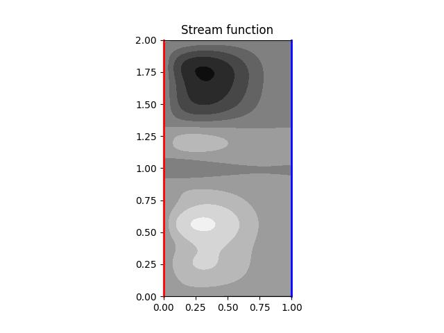
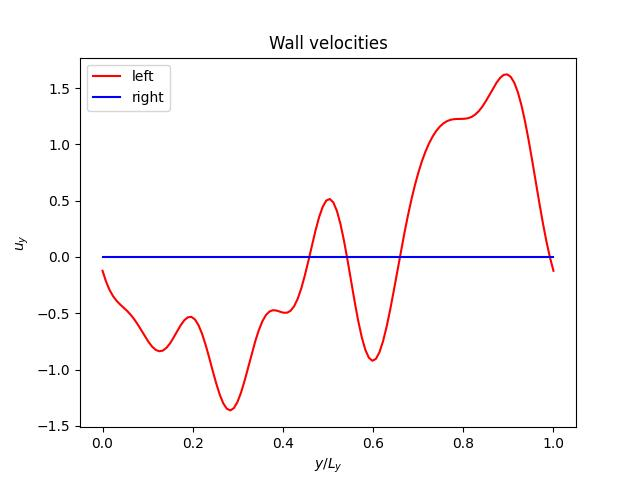

#####################
Cartesian coordinates
#####################

The biharmonic equation in Cartesian coordinates is written explicitly as:

.. math::

    \newcommand{\vx}{x}
    \newcommand{\vy}{y}
    \newcommand{\lx}{L_{\vx}}
    \newcommand{\ly}{L_{\vy}}
    \newcommand{\ux}{u_{\vx}}
    \newcommand{\uy}{u_{\vy}}
    \pder{4}{\psi}{\vx}
    +
    2
    \pder{2}{}{\vx}
    \pder{2}{\psi}{\vy}
    +
    \pder{4}{\psi}{\vy}
    =
    0.

The domain is wall-bounded in the :math:`x` direction.
The boundary conditions on the walls are

.. math::

    \ux
    &
    =
    \pder{}{\psi}{\vy}
    =
    0,

    \uy
    &
    =
    -
    \pder{}{\psi}{\vx}
    =
    f_{\pm} \left( \vy \right),

where :math:`f_{\pm} \left( \vy \right)` represents the prescribed wall velocities.

Using the Fourier series, :math:`\psi` reads

.. math::

    \psi \left( \vx, \vy \right)
    =
    \sum_k \Psi_k \left( \vx \right) \expp{I k \vy},

where :math:`I` is the imaginary unit and :math:`k \equiv 2 \pi k^\prime / \ly` with :math:`k^\prime \in \mathbb{Z}` being the wave number.

Substituting this relation into the biharmonic equation yields:

.. math::

    \sum_k
    \left(
        k^4
        \Psi_k
        -
        2
        k^2
        \der{2}{\Psi_k}{\vx}
        +
        \der{4}{\Psi_k}{\vx}
    \right)
    \expp{I k \vy}
    =
    0.

Due to the orthogonality of the trigonometric functions, we obtain

.. math::

    \der{4}{\Psi_k}{\vx}
    -
    2
    k^2
    \der{2}{\Psi_k}{\vx}
    +
    k^4
    \Psi_k
    =
    0.

Since the characteristic equation of this differential equation:

.. math::

    \lambda^4
    -
    2
    k^2
    \lambda^2
    +
    k^4
    =
    0

has the roots:

.. math::

    \lambda
    =
    \pm k,

the homogeneous solution leads to

.. math::

    \Psi_k
    =
    A_k \expp{kx}
    +
    B_k \vx \expp{kx}
    +
    C_k \expp{- kx}
    +
    D_k \vx \expp{- kx},

and its wall-normal derivative:

.. math::

    \der{}{\Psi_k}{\vx}
    =
    A_k k \expp{k \vx}
    +
    B_k \left( 1 + k \vx \right) \expp{k \vx}
    +
    C_k \left( - k \right) \expp{- k \vx}
    +
    D_k \left( 1 - k \vx \right) \expp{- k \vx}.

The coefficients :math:`A_k, B_k, C_k, D_k` are determined from the boundary conditions:

.. math::

    \ux
    =
    \pder{}{\psi}{\vy}
    =
    \sum_k
    I k
    \Psi_k
    \expp{I k \vy}
    =
    0,

.. math::

    \uy
    =
    -
    \pder{}{\psi}{\vx}
    =
    -
    \sum_k
    \der{}{\Psi_k}{\vx}
    \expp{I k \vy}
    =
    f_{\pm} \left( \vy \right),

or equivalently:

.. math::

    I k
    \Psi_k
    =
    0,

.. math::

    \der{}{\Psi_k}{\vx}
    =
    -
    \int
    f_{\pm} \left( \vy \right)
    \expp{- I k \vy}
    d \vy.

The second relation is simply the Fourier transform of the prescribed wall velocities with the sign flipped, while the first relation states that

.. math::

    \Psi_k
    =
    0

for :math:`k \ne 0`, while :math:`k = 0` imposes no condition, as we only enforce Neumann conditions with respect to :math:`\psi`.

The implementation is as follows.

.. literalinclude:: ./cartesian.py
   :pyobject: compute_stream_function

.. literalinclude:: ./cartesian.py
   :pyobject: compute_boundary_condition

.. literalinclude:: ./cartesian.py
   :pyobject: get_f

.. literalinclude:: ./cartesian.py
   :pyobject: get_dfdx

The computed stream function under

.. math::

    \lx
    &
    =
    1,

    \ly
    &
    =
    2,

    f_{-} \left( \vy \right)
    &
    =
    \sum_{k = 1}^8
    k^{-1}
    \sin \left( 2 \pi k \frac{\vy}{\ly} + \varphi_k \right),

    f_{+} \left( \vy \right)
    &
    =
    0

is shown below:

