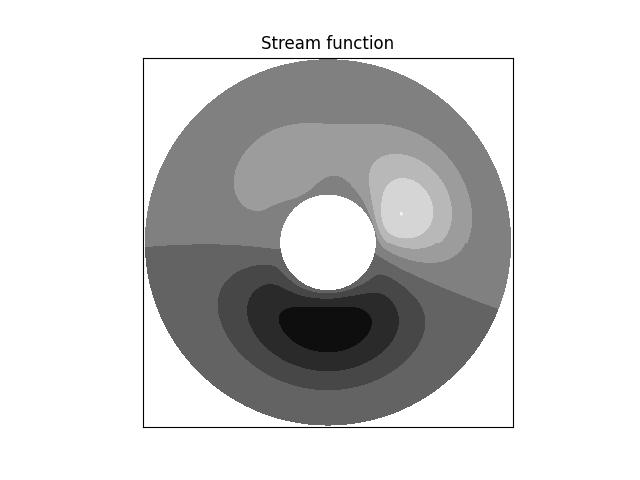
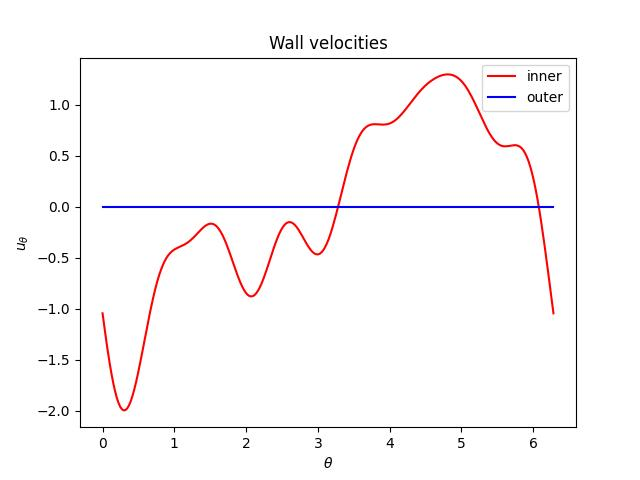

.. include:: /reference.txt

#################
Polar coordinates
#################

The biharmonic equation in polar coordinates is written explicitly as:

.. math::

    \newcommand{\vx}{r}
    \newcommand{\vy}{\theta}
    \newcommand{\lx}{L_{\vx}}
    \newcommand{\ly}{L_{\vy}}
    \newcommand{\ux}{u_{\vx}}
    \newcommand{\uy}{u_{\vy}}
    \frac{1}{\vx}
    \pder{}{}{\vx}
    \left(
        \vx
        \pder{}{}{\vx}
        \left(
            \frac{1}{\vx}
            \pder{}{}{\vx}
            \left(
                \vx
                \pder{}{\psi}{\vx}
            \right)
        \right)
    \right)
    +
    2
    \frac{1}{\vx}
    \pder{}{}{\vy}
    \left(
        \frac{1}{\vx}
        \pder{}{}{\vy}
        \left(
            \pder{}{}{\vx}
            \pder{}{\psi}{\vx}
        \right)
    \right)
    +
    \frac{1}{\vx}
    \pder{}{}{\vy}
    \left(
        \frac{1}{\vx}
        \pder{}{}{\vy}
        \left(
            \frac{1}{\vx}
            \pder{}{}{\vy}
            \left(
                \frac{1}{\vx}
                \pder{}{\psi}{\vy}
            \right)
        \right)
    \right)
    -
    2
    \frac{1}{\vx}
    \frac{1}{\vx}
    \pder{}{}{\vy}
    \left(
        \frac{1}{\vx}
        \pder{}{}{\vy}
        \pder{}{\psi}{\vx}
    \right)
    +
    4
    \frac{1}{\vx}
    \frac{1}{\vx}
    \frac{1}{\vx}
    \pder{}{}{\vy}
    \left(
        \frac{1}{\vx}
        \pder{}{\psi}{\vy}
    \right)
    =
    0.

We adopt a Fourier series to expand the stream function in the azimuthal direction which is periodic:

.. math::

    \psi \left( \vx, \vy \right)
    =
    \sum_k \Psi_k \left( \vx \right) \expp{I k \vy}.

Since the azimuthal derivatives are exchangeable with the rest of the operators, we obtain

.. math::

    \sum_k
    \left[
        \frac{1}{\vx}
        \der{}{}{\vx}
        \left(
            \vx
            \der{}{}{\vx}
            \left(
                \frac{1}{\vx}
                \der{}{}{\vx}
                \left(
                    \vx
                    \der{}{\Psi_k}{\vx}
                \right)
            \right)
        \right)
        -
        \frac{
            2
            k^2
        }{
            \vx^2
        }
        \der{}{}{\vx}
        \der{}{\Psi_k}{\vx}
        +
        \frac{
            2
            k^2
        }{
            \vx^3
        }
        \der{}{\Psi_k}{\vx}
        +
        \frac{
            k^4 - 4 k^2
        }{
            \vx^4
        }
        \Psi_k
    \right]
    \expp{I k \vy}
    =
    0,

or

.. math::

    \frac{1}{\vx}
    \der{}{}{\vx}
    \left(
        \vx
        \der{}{}{\vx}
        \left(
            \frac{1}{\vx}
            \der{}{}{\vx}
            \left(
                \vx
                \der{}{\Psi_k}{\vx}
            \right)
        \right)
    \right)
    -
    \frac{
        2
        k^2
    }{
        \vx^2
    }
    \der{}{}{\vx}
    \der{}{\Psi_k}{\vx}
    +
    \frac{
        2
        k^2
    }{
        \vx^3
    }
    \der{}{\Psi_k}{\vx}
    +
    \frac{
        k^4 - 4 k^2
    }{
        \vx^4
    }
    \Psi_k
    =
    0

due to the orthogonality of the trigonometric functions.
Note that this can be written differently:

.. math::

    \vx^4
    \der{4}{\Psi_k}{\vx}
    +
    2 \vx^3
    \der{3}{\Psi_k}{\vx}
    -
    \left( 2 k^2 + 1 \right) \vx^2
    \der{2}{\Psi_k}{\vx}
    +
    \left( 2 k^2 + 1 \right) \vx
    \der{}{\Psi_k}{\vx}
    +
    \left( k^4 - 4 k^2 \right)
    \Psi_k
    =
    0.

Here we perform a change-of-variable following |WOOD2019|:

.. math::

    \vx = \expp{s}.

By using

.. math::

    \der{}{}{\vx}
    =
    \expp{-s} \der{}{}{s},

we notice

.. math::

    \vx \der{}{}{\vx}
    &
    =
    \der{}{}{s},

    \vx^2 \der{2}{}{\vx}
    &
    =
    \der{2}{}{s}
    -
    \der{}{}{s},

    \vx^3
    \der{3}{}{\vx}
    &
    =
    \der{3}{}{s}
    -
    3
    \der{2}{}{s}
    +
    2
    \der{}{}{s},

    \vx^4
    \der{4}{}{\vx}
    &
    =
    \der{4}{}{s}
    -
    6
    \der{3}{}{s}
    +
    11
    \der{2}{}{s}
    -
    6
    \der{}{}{s},

and thus we obtain

.. math::

    \der{4}{\Psi_k}{s}
    -
    4
    \der{3}{\Psi_k}{s}
    +
    \left(
        - 2 k^2
          +
          4
    \right)
    \der{2}{\Psi_k}{s}
    +
    4 k^2
    \der{}{\Psi_k}{s}
    +
    \left(
        k^4
        -
        4 k^2
    \right)
    \Psi_k
    =
    0,

whose characteristic equation is

.. math::

    &
    \lambda^4
    -
    4
    \lambda^3
    +
    \left(
        - 2 k^2
          +
          4
    \right)
    \lambda^2
    +
    4 k^2
    \lambda
    +
    \left(
        k^4
        -
        4 k^2
    \right)

    =
    &
    \left(
        \lambda^2 - k^2
    \right)
    \left[
        \left( \lambda - 2 \right)^2
        -
        k^2
    \right]

    =
    &
    0,

whose four roots are :math:`\lambda = \pm k, 2 \pm k`.

At :math:`k = 0`, we have :math:`\lambda = 0, 0, 2, 2` (two multiple roots) and

.. math::

    \Psi_0
    &
    =
    \left( A_0 + B_0 s \right)
    +
    \left( C_0 + D_0 s \right) \expp{2 s}

    &
    =
    A_0
    +
    B_0 \log \vx
    +
    C_0 \vx^2
    +
    D_0 \vx^2 \log \vx.

At :math:`k = \pm 1`, we have :math:`\lambda = - 1, 1, 1, 3` (one multiple root) and thus

.. math::

    \Psi_1
    &
    =
    A_1 \expp{- s}
    +
    \left( B_1 + C_1 s \right) \expp{s}
    +
    D_1 \expp{3 s}

    &
    =
    A_1 \vx^{-1}
    +
    B_1 \vx
    +
    C_1 \vx \log \vx
    +
    D_1 \vx^3.

For the other :math:`k` which is not :math:`0` nor :math:`\pm 1`, we have :math:`\lambda = \pm k, 2 \pm k` (no multiple roots) and thus

.. math::

    \Psi_k
    &
    =
    A_k \expp{- k s}
    +
    B_k \expp{+ k s}
    +
    C_k \expp{\left( 2 - k \right) s}
    +
    D_k \expp{\left( 2 + k \right) s}

    &
    =
    A_k \vx^{-k}
    +
    B_k \vx^k
    +
    C_k \vx^{2 - k}
    +
    D_k \vx^{2 + k}.

To summarize, the general solution leads to

.. math::

    \Psi_k
    =
    \begin{cases}
        k = 0
        &
        E
        +
        F \log \vx
        +
        G \vx^2
        +
        H \vx^2 \log \vx, \\
        k = \pm 1
        &
        I \vx^{-1}
        +
        J \vx
        +
        K \vx \log \vx
        +
        L \vx^3, \\
        \text{otherwise}
        &
        A_k \vx^{-k}
        +
        B_k \vx^k
        +
        C_k \vx^{2 - k}
        +
        D_k \vx^{2 + k}.
    \end{cases}

The wall-normal derivative is

.. math::

    \der{}{\Psi_k}{\vx}
    =
    \begin{cases}
        k = 0
        &
        F \vx^{-1}
        +
        2 G \vx
        +
        H \left( 2 \vx \log \vx + \vx \right), \\
        k = \pm 1
        &
        -
        I \vx^{-2}
        +
        J
        +
        K \left( \log \vx + 1 \right)
        +
        3 L \vx^2, \\
        \text{otherwise}
        &
        A_k \left( - k \right) \vx^{- k - 1}
        +
        B_k k \vx^{k - 1}
        +
        C_k \left( 2 - k \right) \vx^{1 - k}
        +
        D_k \left( 2 + k \right) \vx^{1 + k}.
    \end{cases}

The coefficients are determined by incorporating the boundary conditions imposed on the walls; namely, at :math:`\vx = \vx_i > 0` and :math:`\vx = \vx_o > \vx_i`, we enforce

.. math::

    \ux
    &
    =
    \frac{1}{\vx} \pder{}{\psi}{\vy}
    =
    \frac{1}{\vx} \sum_k I k \Psi_k \expp{I k \vy}
    =
    0,

    \uy
    &
    =
    -
    \pder{}{\psi}{\vx}
    =
    -
    \sum_k \der{}{\Psi_k}{\vx} \expp{I k \vy}
    =
    f_{\vx_i, \vx_o} \left( \vy \right),

which are, by performing forward transform:

.. math::

    I k \Psi_k
    =
    0,

.. math::

    \der{}{\Psi_k}{\vx}
    =
    -
    \int
    f_{\vx_i, \vx_o} \left( \vy \right)
    \expp{- I k \vy}
    d \vy.

The implementation is as follows.

.. literalinclude:: ./polar.py
   :pyobject: compute_stream_function

.. literalinclude:: ./polar.py
   :pyobject: compute_boundary_condition

.. literalinclude:: ./polar.py
   :pyobject: get_f

.. literalinclude:: ./polar.py
   :pyobject: get_dfdx

The results are displayed below.

