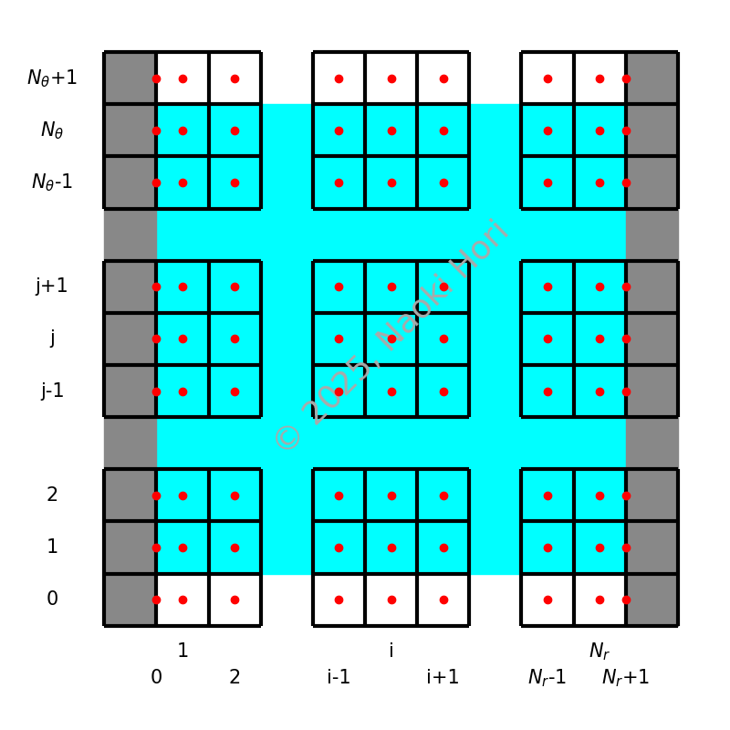

.. include:: /reference.txt

###################
Numerical Treatment
###################

Let :math:`c_{i, j}` be the concentration field, where the indices :math:`i` and :math:`j` denote the spatial locations in the radial and azimuthal directions, respectively.
The index ranges are :math:`i = 0, 1, \dots, \nr, \nr + 1` and :math:`j = 0, 1, \dots, \nt, \nt + 1`, where :math:`i = 0, \nr + 1` and :math:`j = 0, \nt + 1` store the boundary values and reflect periodicity, respectively.
The following diagram illustrates the positioning of the concentration field :math:`c_{i, j}` (reddish dots).

Below we briefly discuss the process to integrate the concentration field in time numerically.
We assume that :math:`c_{i, j}^n`, a concentration field at step :math:`n`, is given.

*************************************
Step 1: Computing the Stream Function
*************************************

To start, from :math:`c` on the particle surface (at :math:`\vr = 1`, or equivalently :math:`i = 0`), we transform it to the spectral domain:

.. math::

    C_k^s
    \equiv
    \sum_{j = 0}^{\nt - 1}
    c_{0, j + 1}
    \expp{- \frac{j k}{\nt} I},

where :math:`k = 0, 1, \dots, \nt - 1`.
Note that, because of :math:`c_{i, j} \in \mathbb{R}`, :math:`C_k^s` satisfies the complex-conjugate property:

.. math::

    C_k^s
    =
    \left( C_{\nt - k}^s \right)^*

for :math:`k = 1, 2, \dots, \nt / 2 - 1`.
Additionally, :math:`C_0^s` and :math:`C_{\nt / 2}^s` are real numbers.

Since the concentration :math:`c` is located at cell centers in the azimuthal direction, we need to apply a half-grid shift azimuthally, which is achieved by modifying the argument:

.. math::

    {C_k^s}^\prime
    \equiv
    C_k^s
    \expp{- \pi \frac{k}{\nt} I}.

Using :math:`{C_k^s}^\prime`, the azimuthal velocity on the particle is obtained by:

.. math::

    \vat{\ut}{r = 1}
    =
    \vat{
        \frac{1}{\vr}
        \pder{}{c}{\vt}
    }{
        r = 1
    },

or in the frequency domain:

.. math::

    \vat{U_\vt}{r = 1}
    \equiv
    U_{\vt}^s
    =
    I k {C_k^s}^\prime.

Finally we evaluate the stream function in the frequency domain at radial cell faces :math:`\Psi_{i + \frac{1}{2}, k}`.
The inverse transform of :math:`\Psi_{i + \frac{1}{2}, k}` yields :math:`\psi_{i + \frac{1}{2}, j + \frac{1}{2}}`, defined at cell corners.

************************************
Step 2: Computing Staggered Velocity
************************************

To ensure conservative transport of the concentration field, the velocity components are positioned in a staggered manner.
Since the stream function :math:`\psi` is defined at cell corners, the staggered velocity components are computed as:

.. math::

    \vat{\ur}{i + \frac{1}{2}, j}
    =
    \frac{1}{\vr_{i + \frac{1}{2}}}
    \vat{\dder{}{\psi}{\vt}}{i + \frac{1}{2}, j},

.. math::

    \vat{\ut}{i, j + \frac{1}{2}}
    =
    -
    \vat{\dder{}{\psi}{\vr}}{i, j + \frac{1}{2}}.

.. note::

    Regardless of how the stream function :math:`\psi` is specified, the discrete incompressibility constraint evaluated at cell centers:

    .. math::

        \frac{1}{\vr}
        \dder{}{}{\vr}
        \left(
            \vr
            \dder{}{\ur}{\vr}
        \right)
        +
        \frac{1}{\vr}
        \dder{}{}{\vt}
        \left(
            \dder{}{\ut}{\vt}
        \right)
        =
        0,
        \,\,
        \forall
        \left( i, j \right)

    is always satisfied.

**************************************
Step 3: Transporting the Concentration
**************************************

Since the concentration field is located at cell centers and is surrounded by staggered velocity components, we update :math:`c` using the standard approach:

.. math::

    \pder{}{\scalar}{t}
    =
    &
    -
    \dscalaradv{1}{\scalar}
    -
    \dscalaradv{2}{\scalar}

    &
    +
    \frac{1}{Pe}
    \dscalardif{1}{\scalar}
    +
    \frac{1}{Pe}
    \dscalardif{2}{\scalar}.

The radial boundary conditions read

.. math::

    \frac{
        1
    }{
        \vat{\sfact{1}}{r = 1}
    }
    \left(
        c_{1, j}
        -
        c_{0, j}
    \right)
    =
    -1
    \quad
    \Leftrightarrow
    \quad
    c_{0, j}
    =
    c_{1, j}
    +
    \vat{\sfact{1}}{r = 1}

and

.. math::

    c_{\nr + 1, j}
    =
    0.

.. seealso::

    Refer to `SimpleTCSolver <https://github.com/NaokiHori/SimpleTCSolver>`_ for detailed derivation.

The above scheme is first-order accurate in time, which is not sufficient practically.
Also, it is advantageous to treat the diffusive terms implicitly in time to eliminate the severe time-step constraint.
To circumvent these obstacles, here we adopt the third-order Runge-Kutta scheme to improve the temporal accuracy.
Each sub step denoted by the superscript :math:`n` is given by:

.. math::

    &
    h^n
    =
    \left( adv. \right)^n
    +
    \beta^n h^{n - 1},

    &
    \left( \Delta c \right)
    -
    \eta \alpha^n \Delta t
    \left[
        \frac{1}{Pe}
        \dscalardif{1}{\left( \Delta \scalar \right)}
        +
        \frac{1}{Pe}
        \dscalardif{2}{\left( \Delta \scalar \right)}
    \right]

    &
    \quad
    =
    \gamma^n \Delta t h^n
    +
    \alpha^n \Delta t
    \left[
        \frac{1}{Pe}
        \dscalardif{1}{\scalar^n}
        +
        \frac{1}{Pe}
        \dscalardif{2}{\scalar^n}
    \right]

    &
    \quad
    \equiv
    \left( rhs \right)^n,

    &
    c^{n + 1}
    =
    c^n
    +
    \left( \Delta c \right),

where :math:`\left( adv. \right)` represents the sum of the two advective terms:

.. math::

    \left( adv. \right)^n
    \equiv
    -
    \dscalaradv{1}{\scalar^n}
    -
    \dscalaradv{2}{\scalar^n}.

The parameter :math:`\eta` is a constant that controls the *implicitness* of the scheme.
Typically, we use :math:`\eta = 1 / 2` to achieve a second-order accurate semi-implicit (Crank-Nicolson) scheme or :math:`\eta = 1` for a first-order accurate fully implicit scheme.

The Runge-Kutta coefficients are (|WILLIAMSON1980|):

.. math::

   \begin{array}{c|ccc}
             & 0 & 1 & 2 \\
      \hline
      \alpha & \frac{+1920}{5760} & \frac{+2400}{5760} & \frac{+1440}{5760} \\
      \beta  & \frac{    0}{5760} & \frac{-3200}{5760} & \frac{-6885}{5760} \\
      \gamma & \frac{+1920}{5760} & \frac{+5400}{5760} & \frac{+3072}{5760} \\
   \end{array}

To simplify the discrete Helmholtz operator on the left-hand side, we focus on the azimuthal component of the discrete Laplace operator with respect to a cell-centered quantity :math:`q`:

.. math::

    \dscalardif{2}{q}.

Since neither the azimuthal scale factor :math:`\sfact{2}` nor the Jacobian determinant :math:`J` varies in the azimuthal direction, we can extract the pre-factors from the discrete divergence operator, yielding

.. math::

    \frac{1}{\sfact{2}}
    \frac{1}{\sfact{2}}
    \dif{
    }{\gcs{2}}
    \dif{q}{\gcs{2}}.

Now, we evaluate this quantity at a cell center :math:`\left( i, j \right)`.
Given that the azimuthal grid is equidistant, we expand :math:`q` using a discrete Fourier series:

.. math::

    q_{i, j}
    =
    \sum_l
    Q_{i, l}
    \expp{2 \pi \frac{j l}{\nt} I}.

Since neighboring cell centers yield

.. math::

    q_{i, j \pm 1}
    =
    \sum_l
    Q_{i, l}
    \expp{2 \pi \frac{j l}{\nt} I}
    \expp{\pm 2 \pi \frac{l}{\nt} I},

it follows that

.. math::

    \frac{1}{\sfact{2}}
    \frac{1}{\sfact{2}}
    \dif{
    }{\gcs{2}}
    \dif{q}{\gcs{2}}
    =
    \frac{1}{\sfact{2}}
    \frac{1}{\sfact{2}}
    \sum_l
    \left[
        -
        4 \sin^2 \left( \pi \frac{l}{\nt} \right)
    \right]
    Q_{i, l}
    \expp{2 \pi \frac{j l}{\nt} I}.

As a result, the main equation becomes

.. math::

    \sum_l
    \left[
        \left( \Delta C \right)_{i, l}
        -
        \frac{\eta \alpha^n \Delta t}{Pe}
        \dscalardif{1}{\left( \Delta C \right)_{i, l}}
        +
        4 \sin^2 \left( \pi \frac{l}{\nt} \right)
        \frac{\eta \alpha^n \Delta t}{Pe}
        \frac{1}{\sfact{2}}
        \frac{1}{\sfact{2}}
        \left( \Delta C \right)_{i, l}
    \right]
    \expp{2 \pi \frac{j l}{\nt} I}

    =
    \sum_l
    \left( RHS \right)_{i, l}
    \expp{2 \pi \frac{j l}{\nt} I},

where :math:`\left( \Delta C \right)_{i, k}` and :math:`\left( RHS \right)_{i, l}` denote the Fourier coefficients of :math:`\left( \Delta c \right)` and the right-hand side, respectively.

By applying the forward transform to both sides:

.. math::

    \sum_k
    \left[
        \sum_l
        \left( RHS \right)_{i, l}
        \expp{2 \pi \frac{j l}{\nt} I}
    \right]
    \expp{- 2 \pi \frac{j k}{\nt} I},

we obtain

.. math::

    \left[
        1
        +
        \frac{4 \eta \alpha^n \Delta t}{Pe}
        \left\{
            \frac{1}{\sfact{2}}
            \sin \left( \pi \frac{k}{\nt} \right)
        \right\}^2
    \right]
    \left( \Delta C \right)_{i, k}
    -
    \frac{\eta \alpha^n \Delta t}{Pe}
    \dscalardif{1}{\left( \Delta C \right)_{i, k}}
    =
    \left( RHS \right)_{i, k}.

Since no terms involve :math:`k \pm 1`, this results in a purely tri-diagonal linear system in the radial direction for each azimuthal wave number :math:`k`.

Regarding the radial boundary conditions, because of

.. math::

    c_{0, j}^{n + 1}
    =
    c_{1, j}^{n + 1}
    +
    \vat{\sfact{1}}{r = 1}

and

.. math::

    c_{0, j}^n
    =
    c_{1, j}^n
    +
    \vat{\sfact{1}}{r = 1},

we have

.. math::

    \left( \Delta c \right)_{0, j}
    =
    \left( \Delta c \right)_{1, j}

or in the azimuthal spectral space:

.. math::

    \left( \Delta C \right)_{0, k}
    =
    \left( \Delta C \right)_{1, k},

giving a zero Neumann boundary condition on the particle surface.
On the outer circle where a Dirichlet condition is imposed, we simply have

.. math::

    \left( \Delta C \right)_{\nr + 1, k}
    =
    0.

